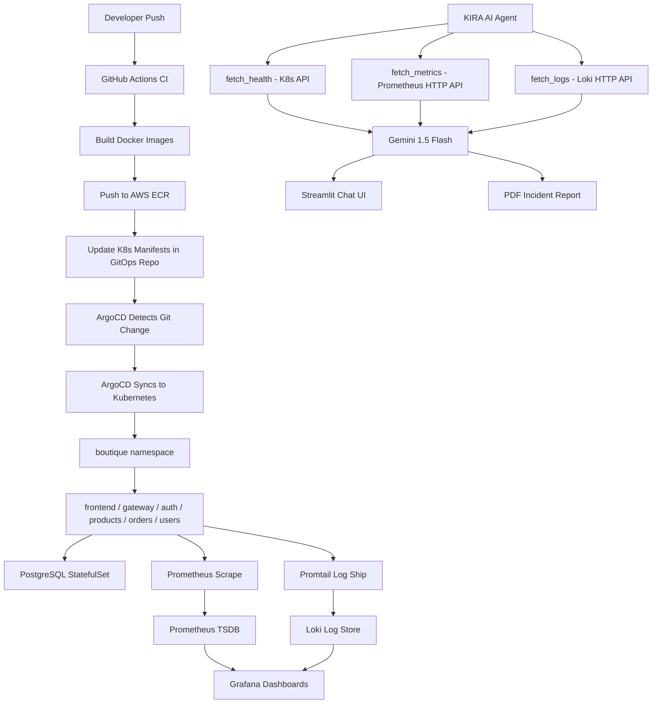
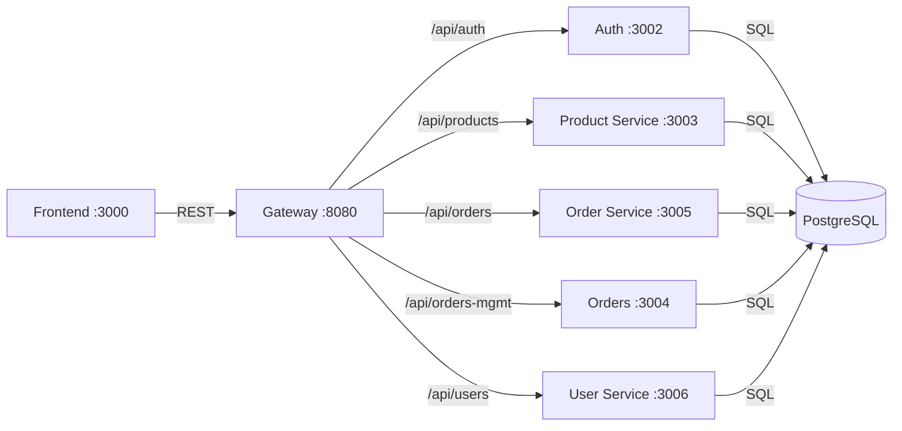

<div align="center">
# Boutique Microservices AIOps Platform

### *KIRA — Kubernetes Intelligent Reasoning Agent*

**An enterprise-grade, cloud-native microservices platform with an AI-powered SRE assistant that observes, reasons, detects incidents, and generates remediation reports — in real time.**

<br/>

[](https://github.com/errornotfound404ajit/boutique-microservices-aiops/actions)
[](https://www.docker.com/)
[](https://kubernetes.io/)
[](https://grafana.com/)
[](https://prometheus.io/)
[](https://argo-cd.readthedocs.io/)
[](https://python.org/)
[](https://ai.google.dev/)
[](https://streamlit.io/)
[](https://aws.amazon.com/)
[](LICENSE)

<br/>

> **"Don't just monitor your infrastructure — make it think."**
> 
> KIRA transforms raw Kubernetes telemetry (Prometheus metrics + Loki logs + pod health) into natural-language SRE-grade root cause analysis, severity classification, and downloadable incident reports — powered by Google Gemini 1.5 Flash.

<br/>

[📖 Docs](#installation-guide) · [🐛 Issues](https://github.com/errornotfound404ajit/boutique-microservices-aiops/issues) · [💬 Discussions](https://github.com/errornotfound404ajit/boutique-microservices-aiops/discussions)

</div>

---

## Table of Contents

- [Overview](#overview)
- [Key Features](#key-features)
- [System Architecture](#system-architecture)
- [Tech Stack](#tech-stack)
- [Screenshots](#screenshots)
- [Project Structure](#project-structure)
- [Installation Guide](#installation-guide)
- [Environment Variables](#environment-variables)
- [Docker Setup](#docker-setup)
- [Kubernetes Deployment](#kubernetes-deployment)
- [CI/CD Pipeline](#cicd-pipeline)
- [GitOps with ArgoCD](#gitops-with-argocd)
- [Monitoring & Observability](#monitoring--observability)
- [KIRA — The AI Agent](#kira--the-ai-agent)
- [API Documentation](#api-documentation)
- [Security Features](#security-features)
- [Performance Optimizations](#performance-optimizations)
- [Future Enhancements](#future-enhancements)
- [Contributors](#contributors)
- [License](#license)

---

## Overview

**Boutique Microservices AIOps Platform** is a production-grade, cloud-native e-commerce application built on a microservices architecture, extended with a fully functional **AIOps observability layer** powered by AI.

The platform demonstrates the complete DevOps/SRE lifecycle:

- **Local development** via Docker Compose with full service orchestration
- **Cloud deployment** on Kubernetes (Minikube locally, AWS EKS in production)
- **GitOps continuous delivery** with ArgoCD and GitHub Actions CI/CD
- **Full-stack observability** with Prometheus, Grafana, and Loki
- **AI-powered incident management** via KIRA — an intelligent agent that ingests live telemetry and reasons over it using Gemini 1.5 Flash

### Why This Project Matters

| Challenge | Solution |
|-----------|----------|
| Manual log triage takes hours | KIRA fetches + reasons over logs automatically |
| Prometheus dashboards require expertise to interpret | Natural-language cluster Q&A via Streamlit Chat UI |
| Incident reports are written manually post-outage | AI-generated PDF incident reports on demand |
| Static alerts miss correlated failures | Rule-based + AI anomaly detection with SEV classification |
| GitOps pipelines are complex to set up | End-to-end GitHub Actions → ECR → ArgoCD → K8s |

---

## Key Features

### Microservices Platform
- **6 independent backend services**: `auth`, `gateway`, `product-service`, `order-service`, `orders`, `user-service`
- **PostgreSQL** with per-service database isolation (`auth_db`, `orders_db`, `products_db`, `users_db`)
- **API Gateway** pattern — single entry point for all frontend traffic
- **Docker Compose** for local orchestration with full networking and dependency management

### Kubernetes & Cloud
- **Kubernetes namespaces** for isolation: `boutique`, `monitoring`, `argocd`
- **StatefulSet** for PostgreSQL with persistent volume claims
- **Kubernetes Secrets** for credential management
- **AWS EKS** support with IAM, IRSA, and EBS CSI for cloud-grade storage
- **ECR** private container registry with automated image tagging

### GitOps & CI/CD
- **GitHub Actions** CI pipeline: build → test → push to ECR → update manifests
- **ArgoCD** GitOps continuous delivery: automatic manifest sync from Git to cluster
- **Image tag automation** via `sed` in CI pipeline for seamless rollouts
- **Branch-based workflows** with environment-specific deployments

### Observability Stack
- **Prometheus** — pull-based metrics scraping from all microservices
- **Grafana** — visual dashboards with provisioned datasources and AIOps panels
- **Loki** — log aggregation for all pods in the `boutique` namespace
- **kube-prometheus-stack** Helm chart for monitoring namespace
- **Promtail** daemonset for Kubernetes log shipping to Loki
- **Fluent Bit** (EKS variant) for cloud-native log forwarding to CloudWatch/Loki

### KIRA — AI Observability Agent
- **Google Gemini 1.5 Flash** as the reasoning engine
- **Retrieval-Augmented Observability (RAO)**: KIRA fetches real telemetry before reasoning
- **3-tool sensing layer**: `fetch_health()` → K8s API, `fetch_metrics()` → Prometheus, `fetch_logs()` → Loki
- **Automated incident detection** with SEV-1/SEV-2/SEV-3 classification
- **Streamlit Chat UI** — ChatGPT-style natural language interface
- **PDF incident report generation** — downloadable engineering reports from AI analysis
- **Role-engineered prompts** — KIRA operates as a "Senior SRE with 10 years of Kubernetes experience"

---

## System Architecture

### High-Level Architecture

```
┌─────────────────────────────────────────────────────────────────────────┐
│                        USER / BROWSER                                   │
└────────────────────────────┬────────────────────────────────────────────┘
                             │ HTTP :3000
                             ▼
┌─────────────────────────────────────────────────────────────────────────┐
│                     FRONTEND (React/Next.js)                            │
│                         Port: 3000                                      │
└────────────────────────────┬────────────────────────────────────────────┘
                             │ REST API
                             ▼
┌─────────────────────────────────────────────────────────────────────────┐
│                      API GATEWAY (Node.js)                              │
│                         Port: 8080                                      │
└──────┬──────────┬──────────┬──────────┬──────────┬──────────────────────┘
       │          │          │          │          │
       ▼          ▼          ▼          ▼          ▼
  ┌────────┐ ┌────────┐ ┌────────┐ ┌────────┐ ┌────────┐
  │  Auth  │ │Product │ │ Order  │ │ Orders │ │  User  │
  │:3002   │ │Service │ │Service │ │ :3004  │ │Service │
  └────┬───┘ │ :3003  │ │ :3005  │ └───┬────┘ │ :3006  │
       │     └───┬────┘ └───┬────┘     │      └───┬────┘
       └─────────┴──────────┴──────────┴──────────┘
                                 │
                                 ▼
              ┌──────────────────────────────────┐
              │   PostgreSQL (StatefulSet)        │
              │   auth_db | orders_db             │
              │   products_db | users_db          │
              └──────────────────────────────────┘

━━━━━━━━━━━━━━━━━━━━ OBSERVABILITY LAYER ━━━━━━━━━━━━━━━━━━━━

  Prometheus ──scrapes──► All Services (:metrics endpoint)
  Loki       ◄──ships──── Promtail (DaemonSet)
  Grafana    ──queries──► Prometheus + Loki
  KIRA AI    ──queries──► K8s API + Prometheus + Loki

━━━━━━━━━━━━━━━━━━━━ CI/CD LAYER ━━━━━━━━━━━━━━━━━━━━━━━━━━━━

  GitHub Actions ──build+push──► AWS ECR
  GitHub Actions ──update──────► GitOps Manifests (git)
  ArgoCD         ──sync──────── ► Kubernetes Cluster
```

### Data Flow Diagram



### Microservice Communication Map



---

## Tech Stack

### Application Layer

| Category | Technology | Purpose |
|----------|------------|---------|
| **Frontend** | React / Next.js | E-commerce storefront UI |
| **API Gateway** | Node.js (Express) | Reverse proxy, routing |
| **Auth Service** | Node.js | JWT authentication |
| **Product Service** | Node.js | Product catalog CRUD |
| **Order Service** | Node.js | Order creation & tracking |
| **Orders Service** | Node.js | Order management |
| **User Service** | Node.js | User profile management |
| **Database** | PostgreSQL 15 | Relational data persistence |

### DevOps & Infrastructure

| Category | Technology | Purpose |
|----------|------------|---------|
| **Containerization** | Docker + Docker Compose | Local orchestration |
| **Container Registry** | AWS ECR | Private image storage |
| **Orchestration** | Kubernetes (Minikube / EKS) | Production container management |
| **GitOps** | ArgoCD | Declarative continuous delivery |
| **CI/CD** | GitHub Actions | Build, test, push pipeline |
| **Storage** | AWS EBS CSI (EKS), hostPath (local) | Persistent volumes |
| **IaC** | Kubernetes manifests (Kustomize) | Infrastructure as code |

### Observability Stack

| Category | Technology | Purpose |
|----------|------------|---------|
| **Metrics** | Prometheus | Pull-based metrics scraping |
| **Dashboards** | Grafana | Visualization & alerting |
| **Logs** | Loki | Log aggregation & querying |
| **Log Shipping** | Promtail / Fluent Bit | Log forwarding from pods |
| **Query Language** | PromQL / LogQL | Metrics & logs querying |

### AI / AIOps Layer

| Category | Technology | Purpose |
|----------|------------|---------|
| **AI Model** | Google Gemini 1.5 Flash | LLM reasoning engine |
| **AI Framework** | `google-generativeai` | Gemini Python SDK |
| **Chat UI** | Streamlit | Web-based conversational interface |
| **Report Generation** | Python (PDF) | Automated incident reports |
| **Anomaly Detection** | Rule-based + AI hybrid | SEV-1/SEV-2/SEV-3 classification |
| **Pattern** | Retrieval-Augmented Observability | Grounding AI in real telemetry |

### Cloud (Production)

| Category | Technology | Purpose |
|----------|------------|---------|
| **Cloud** | AWS | Production cloud provider |
| **Kubernetes** | AWS EKS | Managed Kubernetes |
| **Registry** | AWS ECR | Managed container registry |
| **IAM** | AWS IAM + IRSA | Secure service authentication |
| **Storage** | AWS EBS | Persistent Kubernetes volumes |
| **Logging** | AWS CloudWatch (optional) | Cloud-native log storage |

---

## Screenshots

### KIRA — AI Chat Interface

<p align="center">
  
  
</p>

*KIRA provides natural-language root cause analysis by ingesting live Prometheus metrics, Loki logs, and Kubernetes pod health.*

---

### KIRA — AIOps Dashboard & Incident Reports

<p align="center">
  
  
</p>

*AI-generated dashboards and downloadable PDF incident reports — produced automatically from live cluster telemetry.*

---

### Grafana — Observability Dashboards

<p align="center">
  
  
</p>

<p align="center">
  
</p>

*Grafana dashboards provisioned via code — AIOps-oriented panels show service uptime, error rates, HTTP response codes, pod restart frequency, and live alert rules.*

---

### Prometheus — Metrics Explorer

<p align="center">
  
</p>

*Prometheus scraping internal Docker/Kubernetes service endpoints. All 6 microservices report health metrics in real time.*

---

### Kubernetes — Cluster State

<p align="center">
  
  
</p>

*Kubernetes deployments running across the `boutique` namespace, with EKS worker nodes provisioned via AWS.*

---

### ArgoCD — GitOps Continuous Delivery

<p align="center">
  
  
</p>

*ArgoCD continuously syncs the GitOps manifests to the Kubernetes cluster — showing full microservices topology and application health.*

---

### Frontend — Boutique Storefront

<p align="center">
  
</p>

*The Boutique e-commerce storefront with product catalog, cart, and checkout flow.*

---

## Project Structure

```
boutique-microservices-aiops/
│
├── .github/
│   └── workflows/
│       └── ci.yml                    # GitHub Actions CI/CD pipeline
│
├── backend/                          # Backend microservices
├── frontend/                         # React/Next.js storefront
├── database/                         # DB schemas and migrations
├── grafana/                          # Grafana provisioning configs
├── prometheus/                       # Prometheus scrape config
├── shared/                           # Shared utilities/libs
│
├── gitops/                           # GitOps Kubernetes manifests
│   └── k8s/
│       ├── namespace/
│       ├── backend/
│       ├── frontend/
│       ├── database/
│       └── secrets/
│
├── kira-aiops/                       # 🤖 KIRA AI Agent
│   ├── app.py                        # Streamlit Chat UI (main entry)
│   ├── requirements.txt
│   ├── .env                          # API keys (gitignored)
│   ├── ai/
│   │   ├── gemini_agent.py           # Core AI reasoning engine
│   │   └── incident_detector.py      # Rule-based SEV classifier
│   ├── tools/
│   │   ├── health.py                 # Kubernetes pod health fetcher
│   │   ├── metrics.py                # Prometheus metrics fetcher
│   │   └── logs.py                   # Loki log fetcher
│   └── report_generator.py           # PDF incident report builder
│
├── docs/
│   ├── assets/
│   │   └── aiops-dashboard-2.png.png # Banner image
│   └── screenshots/
│       ├── aiops-chat.png.png
│       ├── aiops-chat-2.png.png
│       ├── aiops-dashboard.png.png
│       ├── aiops-incident-report.png.png
│       ├── argocd-application-overview.png.png
│       ├── argocd-microservices-topology.png.png
│       ├── eks-nodes.png.png
│       ├── frontend_ui.png.png
│       ├── grafana-alerting-system.png.png
│       ├── grafana-cluster.png.png
│       ├── grafana-observability-dashboard.png.png
│       ├── kubernetes-pods.png.png
│       └── prometheus-dashboard.png.png
│
├── docker-compose.yml                # Full local stack orchestration
├── .env.example
├── .gitignore
├── alertmanager-slack.yaml
├── pod-restart-alert.yaml
└── health-check.sh
```

---

## Installation Guide

### Prerequisites

Ensure the following tools are installed and configured:

| Tool | Version | Install |
|------|---------|---------|
| Docker Desktop | ≥ 4.x | [docs.docker.com](https://docs.docker.com/get-docker/) |
| Docker Compose | ≥ v2.x | Bundled with Docker Desktop |
| kubectl | ≥ 1.28 | [kubernetes.io/docs](https://kubernetes.io/docs/tasks/tools/) |
| Minikube | ≥ 1.33 | [minikube.sigs.k8s.io](https://minikube.sigs.k8s.io/) |
| Python | ≥ 3.11 | [python.org](https://python.org/) |
| Git | ≥ 2.x | [git-scm.com](https://git-scm.com/) |
| AWS CLI | ≥ 2.x (optional) | [aws.amazon.com/cli](https://aws.amazon.com/cli/) |

### 1. Clone the Repository

```bash
git clone https://github.com/errornotfound404ajit/boutique-microservices-aiops.git
cd boutique-microservices-aiops/projects/boutique-microservices
```

### 2. Local Development — Docker Compose

#### Start the Full Stack

```bash
# Start all services (postgres, gateway, auth, products, orders, users, frontend, prometheus, grafana, loki)
docker compose up -d

# Verify all containers are running
docker ps

# Check service logs
docker compose logs -f gateway
```

#### Access Services

| Service | URL |
|---------|-----|
| Frontend | http://localhost:3000 |
| API Gateway | http://localhost:8080 |
| Grafana | http://localhost:3000 (admin/admin) |
| Prometheus | http://localhost:9090 |
| Loki | http://localhost:3100 |

#### Stop the Stack

```bash
docker compose down
# To remove volumes too (full reset):
docker compose down -v
```

### 3. KIRA AI Agent Setup

```bash
cd projects/boutique-microservices/kira-aiops

# Create and activate virtual environment
python -m venv venv

# Windows
venv\Scripts\activate
# macOS/Linux
source venv/bin/activate

# Install dependencies
pip install -r requirements.txt

# Copy environment template
cp .env.example .env
# Edit .env — add your GEMINI_API_KEY
```

#### Run KIRA CLI Mode

```bash
python -m ai.gemini_agent
# Ask: "Why is the frontend slow?"
# Ask: "Analyze my cluster health"
```

#### Run KIRA Streamlit UI

```bash
streamlit run app.py
# Open: http://localhost:8501
```

---

## Environment Variables

### Core Application (`.env` in `kira-aiops/`)

| Variable | Required | Description | Example |
|----------|----------|-------------|---------|
| `GEMINI_API_KEY` | ✅ | Google Gemini API key | `AIza...` |
| `PROMETHEUS_URL` | ✅ | Prometheus HTTP endpoint | `http://127.0.0.1:9090` |
| `LOKI_URL` | ✅ | Loki HTTP endpoint | `http://127.0.0.1:3100` |
| `KUBE_CONTEXT` | ⬜ | Kubernetes context name | `minikube` |

### CI/CD Secrets (GitHub Actions)

| Secret | Description |
|--------|-------------|
| `AWS_REGION` | AWS region for ECR (`us-east-1`) |
| `AWS_ACCESS_KEY_ID` | IAM user access key |
| `AWS_SECRET_ACCESS_KEY` | IAM user secret key |
| `ECR_REGISTRY` | ECR registry URL (`<account>.dkr.ecr.us-east-1.amazonaws.com`) |

### Kubernetes Secrets (`k8s/secrets/app-secrets.yml`)

```yaml
apiVersion: v1
kind: Secret
metadata:
  name: app-secrets
  namespace: boutique
type: Opaque
stringData:
  POSTGRES_USER: postgres
  POSTGRES_PASSWORD: <your-secure-password>
  JWT_SECRET: <your-jwt-secret>
  DATABASE_URL: postgresql://postgres:<password>@boutique-postgres:5432
```

> ⚠️ **Never commit real credentials.** Use `stringData` with sealed-secrets or AWS Secrets Manager in production.

---

## Docker Setup

### Service Architecture in `docker-compose.yml`

```yaml
services:
  postgres:          # PostgreSQL 15 — shared database host
  gateway:           # API Gateway — routes to all backends
  auth:              # Authentication — JWT issuance/validation
  product-service:   # Product catalog
  order-service:     # Order processing
  orders:            # Order management
  user-service:      # User profiles
  frontend:          # React storefront
  prometheus:        # Metrics collection
  grafana:           # Dashboards
  loki:              # Log aggregation
  promtail:          # Log shipper
```

### Key Docker Commands

```bash
# Build all images
docker compose build

# Start specific service
docker compose up -d grafana

# View real-time logs
docker compose logs -f --tail=100

# Execute command inside container
docker exec -it boutique-microservices-gateway-1 sh

# Inspect Docker network (internal service DNS)
docker network inspect boutique-microservices_default

# Remove stopped containers
docker compose rm -f

# Nuclear reset (removes volumes)
docker compose down --volumes --remove-orphans
```

### Networking

All services communicate over the internal Docker bridge network. Services reference each other by container name:

```
http://auth:3002
http://product-service:3003
http://order-service:3005
http://postgres:5432
http://loki:3100
```

---

## Kubernetes Deployment

### Local — Minikube

#### Prerequisites

```bash
# Start Minikube with sufficient resources
minikube start --driver=docker --memory=7000 --cpus=4

# Verify cluster health
kubectl get nodes
kubectl get pods -A
```

#### Deploy the Application

```bash
cd projects/boutique-microservices

# Create namespaces
kubectl apply -f gitops/k8s/namespace/

# Deploy secrets first
kubectl apply -f gitops/k8s/secrets/

# Deploy database
kubectl apply -f gitops/k8s/database/

# Wait for PostgreSQL to be Ready
kubectl get pods -n boutique -w

# Initialize databases
kubectl exec -it boutique-postgres-0 -n boutique -- sh
# Inside container:
psql -U postgres
# Run:
# CREATE DATABASE auth_db;
# CREATE DATABASE orders_db;
# CREATE DATABASE products_db;
# CREATE DATABASE users_db;
# \q

# Deploy all backend services
kubectl apply -f gitops/k8s/backend/
kubectl apply -f gitops/k8s/frontend/

# Verify all pods running
kubectl get pods -n boutique
```

#### Access Services via Port-Forward

```bash
# Frontend
kubectl port-forward svc/frontend -n boutique 3001:3000

# Grafana
kubectl port-forward svc/monitoring-grafana -n monitoring 3000:80

# Prometheus
kubectl port-forward svc/monitoring-kube-prometheus-prometheus -n monitoring 9090:9090

# ArgoCD
kubectl port-forward svc/argocd-server -n argocd 9090:443

# Loki (for KIRA)
kubectl port-forward svc/loki -n monitoring 3100:3100
```

#### Install Monitoring Stack (Helm)

```bash
# Add Helm repos
helm repo add prometheus-community https://prometheus-community.github.io/helm-charts
helm repo add grafana https://grafana.github.io/helm-charts
helm repo update

# Install kube-prometheus-stack
helm install monitoring prometheus-community/kube-prometheus-stack \
  --namespace monitoring \
  --create-namespace

# Install Loki stack
helm install loki grafana/loki-stack \
  --namespace monitoring \
  --set grafana.enabled=false \
  --set promtail.enabled=true
```

### Namespace Structure

```
boutique          → Application workloads
monitoring        → Prometheus, Grafana, Loki, Promtail
argocd            → ArgoCD GitOps controller
kube-system       → Kubernetes system components
```

### Production — AWS EKS

```bash
# Create EKS cluster (with eksctl)
eksctl create cluster \
  --name boutique-aiops \
  --region us-east-1 \
  --nodegroup-name standard-workers \
  --node-type t3.medium \
  --nodes 3 \
  --managed

# Install AWS EBS CSI driver
eksctl create addon --name aws-ebs-csi-driver \
  --cluster boutique-aiops \
  --service-account-role-arn arn:aws:iam::<account>:role/AmazonEKS_EBS_CSI_DriverRole

# Configure IRSA for EKS IAM integration
eksctl create iamserviceaccount \
  --name ebs-csi-controller-sa \
  --namespace kube-system \
  --cluster boutique-aiops \
  --role-name AmazonEKS_EBS_CSI_DriverRole \
  --attach-policy-arn arn:aws:iam::aws:policy/service-role/AmazonEBSCSIDriverPolicy \
  --approve

# Pull ECR images (update manifests with real ECR URLs)
aws ecr get-login-password --region us-east-1 | \
  docker login --username AWS --password-stdin <account>.dkr.ecr.us-east-1.amazonaws.com
```

---

## CI/CD Pipeline

### GitHub Actions Workflow

The CI pipeline (`.github/workflows/ci.yml`) automates the full build-deploy cycle:

```
Trigger: workflow_dispatch / push to main
       │
       ▼
┌─────────────────────┐
│  Build Stage        │
│  docker compose     │
│  build (all svcs)   │
└──────────┬──────────┘
           │
           ▼
┌─────────────────────┐
│  Push Stage         │
│  ECR login          │
│  tag: ${git SHA}    │
│  push all images    │
└──────────┬──────────┘
           │
           ▼
┌─────────────────────┐
│  GitOps Update      │
│  sed image tags in  │
│  K8s manifests      │
│  git commit + push  │
└──────────┬──────────┘
           │
           ▼
┌─────────────────────┐
│  ArgoCD Auto-Sync   │
│  detects Git change │
│  applies to cluster │
└─────────────────────┘
```

### Pipeline Configuration Highlights

```yaml
name: Boutique CI Pipeline

on:
  workflow_dispatch:

env:
  AWS_REGION: ${{ secrets.AWS_REGION }}
  IMAGE_TAG: ${{ github.sha }}

jobs:
  build-and-push:
    runs-on: ubuntu-latest
    steps:
      - uses: actions/checkout@v3

      - name: Configure AWS credentials
        uses: aws-actions/configure-aws-credentials@v2
        with:
          aws-access-key-id: ${{ secrets.AWS_ACCESS_KEY_ID }}
          aws-secret-access-key: ${{ secrets.AWS_SECRET_ACCESS_KEY }}
          aws-region: ${{ env.AWS_REGION }}

      - name: Login to Amazon ECR
        id: login-ecr
        uses: aws-actions/amazon-ecr-login@v1

      - name: Build and push all service images
        run: |
          docker compose build
          for service in auth gateway product-service order-service orders user-service frontend; do
            docker tag boutique-microservices-$service:latest \
              ${{ steps.login-ecr.outputs.registry }}/$service:${{ env.IMAGE_TAG }}
            docker push ${{ steps.login-ecr.outputs.registry }}/$service:${{ env.IMAGE_TAG }}
          done

      - name: Update GitOps manifests
        run: |
          NEW_TAG=${{ env.IMAGE_TAG }}
          for service in auth gateway product-service order-service orders user-service frontend; do
            sed -i "s|image:.*$service:.*|image: $ECR_REGISTRY/$service:$NEW_TAG|g" \
              gitops/k8s/backend/$service.yml
          done
          git config user.email "ci@github.com"
          git config user.name "GitHub Actions"
          git add gitops/
          git commit -m "ci: update image tags to $NEW_TAG [skip ci]"
          git push
```

---

## GitOps with ArgoCD

ArgoCD watches the `gitops/` directory and auto-syncs any manifest changes to the Kubernetes cluster.

### ArgoCD Setup

```bash
# Install ArgoCD
kubectl create namespace argocd
kubectl apply -n argocd \
  -f https://raw.githubusercontent.com/argoproj/argo-cd/stable/manifests/install.yaml

# Get initial admin password
kubectl -n argocd get secret argocd-initial-admin-secret \
  -o jsonpath="{.data.password}" | base64 -d

# Port-forward ArgoCD UI
kubectl port-forward svc/argocd-server -n argocd 9090:443

# Open: https://localhost:9090
```

### Create ArgoCD Application

```yaml
apiVersion: argoproj.io/v1alpha1
kind: Application
metadata:
  name: boutique-app
  namespace: argocd
spec:
  project: default
  source:
    repoURL: https://github.com/errornotfound404ajit/boutique-microservices-aiops
    targetRevision: HEAD
    path: projects/boutique-microservices/gitops/k8s
  destination:
    server: https://kubernetes.default.svc
    namespace: boutique
  syncPolicy:
    automated:
      prune: true
      selfHeal: true
```

---

## Monitoring & Observability

### Prometheus

Prometheus scrapes metrics from all microservices at `/metrics` endpoints inside the Docker/Kubernetes network.

**Key PromQL Queries:**

```promql
# Service uptime
up{job="boutique-services"}

# HTTP request rate
rate(http_requests_total[5m])

# Error rate per service
rate(http_requests_total{status=~"5.."}[5m])

# Pod restart count
kube_pod_container_status_restarts_total{namespace="boutique"}

# Memory usage
container_memory_usage_bytes{namespace="boutique"}
```

### Grafana Dashboards

Dashboards are provisioned via code in `monitoring/grafana/provisioning/dashboards/`.

**Dashboard panels include:**

| Panel | Metric | Query Type |
|-------|--------|------------|
| Service Uptime | `up` per target | Stat |
| Request Rate | `rate(http_requests_total[5m])` | Time Series |
| Error Rate | 5xx responses | Time Series |
| Pod Restarts | `kube_pod_container_status_restarts_total` | Gauge |
| Memory Usage | `container_memory_usage_bytes` | Time Series |
| Log Volume | LogQL `count_over_time` | Bar Chart |
| AIOps Anomaly Score | Custom rule outputs | Stat |

**Access Grafana:**

```
URL: http://localhost:3000
Username: admin
Password: admin (first login, reset recommended)
```

### Loki Log Aggregation

**LogQL Queries:**

```logql
# All boutique namespace logs
{namespace="boutique"}

# Error logs only
{namespace="boutique"} |= "error"

# Specific pod logs
{namespace="boutique", pod="gateway-xxxx"}

# HTTP 5xx errors
{namespace="boutique"} |= "503" or "500"

# Last 15 minutes
{namespace="boutique"} [15m]
```

**Verify Loki Labels:**

```bash
# List available labels
curl http://localhost:3100/loki/api/v1/labels

# Check namespace values
curl http://localhost:3100/loki/api/v1/label/namespace/values

# Expected: ["argocd","boutique","monitoring"]
```

---

## KIRA — The AI Agent

KIRA (**K**ubernetes **I**ntelligent **R**easoning **A**gent) is the AIOps brain of this platform. It transforms raw telemetry into actionable engineering intelligence.

### Architecture

```
User Question
      │
      ▼
┌─────────────────────────────────────────────────────────┐
│              KIRA Reasoning Pipeline                    │
│                                                         │
│  1. fetch_health()   → kubectl API → pod states        │
│  2. fetch_metrics()  → Prometheus  → PromQL response   │
│  3. fetch_logs()     → Loki HTTP   → last 15min logs   │
│                            │                            │
│  4. Prompt Engineering     │                            │
│     Role: "Expert SRE"     │                            │
│     Inject telemetry ──────┘                            │
│                            │                            │
│  5. Gemini 1.5 Flash ◄─────┘                            │
│                            │                            │
│  6. Response + SEV tag     │                            │
│  7. PDF Report Generation  │                            │
└────────────────────────────┼────────────────────────────┘
                             ▼
               Streamlit Chat UI / CLI
```

### Core Agent (`ai/gemini_agent.py`)

```python
def analyze_cluster(question: str) -> str:
    health = fetch_health()      # Kubernetes pod states
    metrics = fetch_metrics()    # Prometheus PromQL data
    logs = fetch_logs()          # Loki last 15 minutes

    prompt = f"""
You are KIRA, an expert Site Reliability Engineer with 10 years of Kubernetes experience.

Analyze the Kubernetes cluster health and answer the user's question.

User Question: {question}

Cluster Health: {json.dumps(health, indent=2)}
Cluster Metrics: {json.dumps(metrics, indent=2)}
Recent Logs: {json.dumps(logs, indent=2)}

Provide:
1. Root cause analysis
2. Important observations
3. Severity assessment (SEV-1 / SEV-2 / SEV-3)
4. Suggested remediation steps
"""
    response = model.generate_content(prompt)
    return response.text
```

### Automated Incident Detection (`ai/incident_detector.py`)

KIRA automatically scans live telemetry and classifies incidents without user prompting:

| Condition | Severity | Detection Method |
|-----------|----------|-----------------|
| Pod not running | SEV-1 | K8s pod status check |
| HTTP 503 in logs | SEV-1 | Loki log pattern match |
| Error logs detected | SEV-2 | Loki log pattern match |
| High pod restart count | SEV-2 | Prometheus metric threshold |
| Slow response time | SEV-3 | Prometheus latency query |

### KIRA Streamlit UI (`app.py`)

The Streamlit interface provides:

- **🤖 Chat interface** — ask KIRA anything about your cluster
- **📊 Sidebar metrics** — live Total Pods / Healthy Pods / Log count
- **🚨 Active Incidents panel** — real-time SEV-1/SEV-2/SEV-3 alerts
- **📜 Log explorer** — raw Loki log viewer (expandable)
- **📊 Metrics snapshot** — Prometheus raw output (expandable)
- **❤️ Cluster health** — Kubernetes pod state viewer (expandable)
- **📄 Download Report** — AI-generated PDF incident report per query

```bash
# Launch KIRA
cd kira-aiops
streamlit run app.py

# Open: http://localhost:8501
```

### Example KIRA Interactions

```
You: "Why is the frontend slow?"

KIRA: Based on current telemetry analysis:

ROOT CAUSE: product-service pod is experiencing high CPU (87%) causing 
cascading latency. Gateway timeout threshold exceeded for /api/products.

SEVERITY: SEV-2

OBSERVATIONS:
- product-service-xxxx: 3 restarts in last 15 minutes
- Prometheus shows p99 latency at 4.2s for /api/products
- Loki logs show: "ETIMEDOUT connecting to postgres:5432"
- PostgreSQL connection pool exhausted (15/15 connections used)

REMEDIATION:
1. Scale product-service: kubectl scale deployment product-service --replicas=3 -n boutique
2. Check Postgres connection limits: SHOW max_connections;
3. Consider connection pooling via PgBouncer
4. Alert: Set Grafana alert for p99 > 2s
```

### `requirements.txt` for KIRA

```txt
streamlit>=1.35.0
google-generativeai>=0.5.0
python-dotenv>=1.0.0
requests>=2.31.0
kubernetes>=29.0.0
fpdf2>=2.7.0
```

---

## API Documentation

### Gateway Routes

All external traffic enters via the API Gateway on port `8080`.

| Method | Endpoint | Service | Description |
|--------|----------|---------|-------------|
| `POST` | `/api/auth/login` | auth | User login, returns JWT |
| `POST` | `/api/auth/register` | auth | User registration |
| `GET` | `/api/products` | product-service | List all products |
| `GET` | `/api/products/:id` | product-service | Get product by ID |
| `POST` | `/api/orders` | order-service | Create new order |
| `GET` | `/api/orders/:id` | order-service | Get order status |
| `GET` | `/api/orders-mgmt` | orders | List all orders (admin) |
| `GET` | `/api/users/profile` | user-service | Get user profile |
| `PUT` | `/api/users/profile` | user-service | Update user profile |
| `GET` | `/metrics` | all services | Prometheus metrics endpoint |

### Internal Service Communication

```
auth       → http://auth:3002
gateway    → http://gateway:8080
products   → http://product-service:3003
orders     → http://order-service:3005
orders-mgmt→ http://orders:3004
users      → http://user-service:3006
```

---

## Security Features

| Feature | Implementation | Status |
|---------|---------------|--------|
| **JWT Authentication** | Issued by `auth` service, validated in gateway | ✅ |
| **Kubernetes Secrets** | Base64-encoded credentials, not in code | ✅ |
| **Private Container Registry** | AWS ECR with IAM access control | ✅ |
| **IAM Roles (IRSA)** | EKS workload identity via IRSA | ✅ |
| **Namespace Isolation** | `boutique`, `monitoring`, `argocd` separated | ✅ |
| **No Secrets in Git** | `.env` gitignored, secrets via K8s Secrets | ✅ |
| **Internal Networking** | Services communicate via private Docker/K8s DNS | ✅ |
| **Non-root Containers** | Containers run as non-root (recommended) | ⚠️ Recommended |
| **Network Policies** | K8s NetworkPolicy for inter-namespace isolation | 🔜 Planned |
| **HTTPS/TLS** | Ingress with TLS termination | 🔜 Planned |

---

## Performance Optimizations

- **Docker layer caching** — images structured for maximum cache reuse in CI builds
- **Multi-stage Docker builds** — production images exclude dev dependencies
- **Kubernetes resource limits** — CPU/memory requests and limits defined per deployment
- **PostgreSQL connection management** — per-service databases prevent cross-service contention
- **Prometheus scrape intervals** — tuned to avoid excessive overhead on small clusters
- **Loki time-range queries** — KIRA queries only the last 15 minutes to minimize latency
- **Streamlit session state** — conversation history persisted in `st.session_state` without external storage
- **ArgoCD automated sync** — eliminates manual kubectl apply steps, reducing human error

---

## Future Enhancements

| Feature | Priority | Description |
|---------|----------|-------------|
| **Auto-remediation simulation** | 🔴 HIGH | KIRA executes `kubectl scale` / `kubectl rollout restart` with user approval |
| **Slack / MS Teams alerts** | 🔴 HIGH | KIRA posts SEV-1 alerts to team channels |
| **Persistent AI memory** | 🔴 HIGH | Vector DB (ChromaDB/Pinecone) for KIRA conversation history |
| **Grafana embedded dashboards** | 🟡 MEDIUM | Embed live Grafana panels inside Streamlit |
| **AI incident timeline** | 🟡 MEDIUM | Chronological visualisation of correlated events |
| **Kubernetes topology graph** | 🔵 ELITE | D3.js graph showing pod-service-ingress relationships |
| **Multi-cluster observability** | 🔵 ELITE | KIRA reasoning over multiple K8s contexts |
| **Voice-enabled assistant** | 🔵 ELITE | Speech-to-text → KIRA → TTS response |
| **Anomaly forecasting** | 🟡 MEDIUM | Time-series ML model on Prometheus data |
| **AWS Bedrock integration** | 🟡 MEDIUM | Enterprise-grade model via AWS managed API |
| **Helm chart packaging** | 🟡 MEDIUM | Install entire stack with single `helm install` |
| **SLO/SLA tracking** | 🔴 HIGH | Error budget dashboards in Grafana |

---

## Contributors

<table>
  <tr>
    <td align="center">
      <a href="https://github.com/errornotfound404ajit">
        <br />
        <sub><b>Ajit</b></sub>
      </a><br />
      <sub>Project Author · DevOps · AIOps</sub>
    </td>
  </tr>
</table>

---

## License

This project is licensed under the **MIT License** — see the [LICENSE](LICENSE) file for details.

```
MIT License — Copyright (c) 2026 Ajit

Permission is hereby granted, free of charge, to any person obtaining a copy
of this software and associated documentation files (the "Software"), to deal
in the Software without restriction, including without limitation the rights
to use, copy, modify, merge, publish, distribute, sublicense, and/or sell
copies of the Software, and to permit persons to whom the Software is
furnished to do so, subject to the following conditions: [...]
```

---

## Contact

**Ajit** — [@errornotfound404ajit](https://github.com/errornotfound404ajit)

Project Repository: [https://github.com/errornotfound404ajit/boutique-microservices-aiops](https://github.com/errornotfound404ajit/boutique-microservices-aiops)

---

<div align="center">

**Built with 🔥 — Local → Docker → Kubernetes → EKS → AIOps**

*From zero to production-grade AI-powered infrastructure observability.*

[](https://github.com/errornotfound404ajit/boutique-microservices-aiops)

</div>
